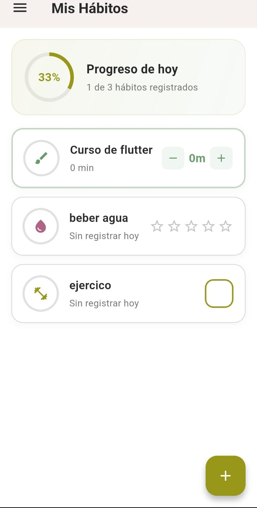
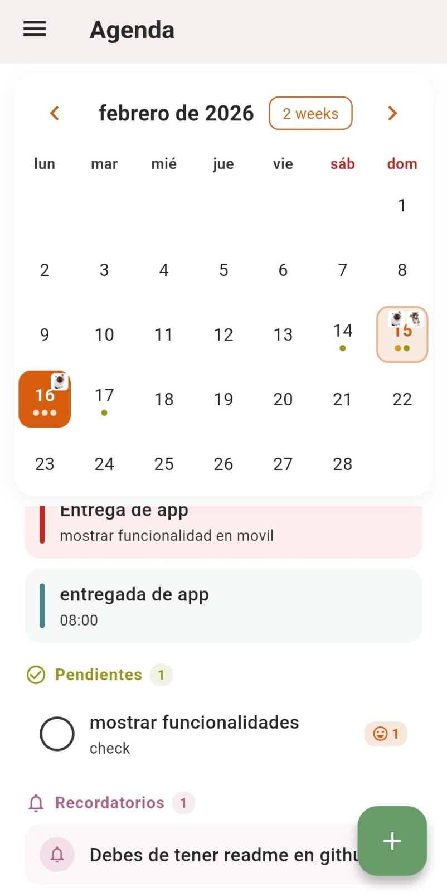

# Agendario

Agendario es una aplicacion que fusiona conceptos de gestion de tiempo, diario personal y autocuantificacion. 

Ete es un espacio digital donde el usuario pueda organizar su dia y reflexionar mediante escritura ademas de registrar sus habitos diarios.

## Funcionalidades Implementadas

### Editor Hibrido
Sistema que combina texto en Markdown con stickers decorativos posicionables libremente sobre la nota. Permite arrastrar y soltar elementos visuales para personalizar cada entrada del diario.

### Sistema de Habitos
Modulo completo para el registro diario de actividades y metricas personales. Incluye visualizacion grafica de rachas y cumplimiento mediante graficos estadisticos y un sistema de logros desbloqueables por constancia.

### Base de Datos Local
Persistencia robusta utilizando Isar Database que permite almacenar entradas complejas con objetos manteniendo un alto rendimiento en dispositivos moviles.

<p align="center">
  
  
  
</p>

## Tecnologias Usadas

### Core
- **Flutter & Dart** Framework principal para desarrollo multiplataforma
- **Isar Database** Base de datos NoSQL para persistencia local
- **Provider** Gestion de estado de la aplicacion

### Librerias Clave
- **Fl Chart** Visualizacion de graficas y estadisticas
- **Flutter Markdown** Renderizado de texto enriquecido
- **Path Provider** Acceso al sistema de archivos del dispositivo

## Implementaciones a Futuro

### Sincronizacion en Nube
Integracion con Firebase Firestore y Authentication para respaldo y sincronizacion de datos entre dispositivos.

### IA
Implementacion de Google Gemini para analisis de patrones en el diario y sugerencias inteligentes basadas en el estado de animo y habitos registrados.

### stikers
Galeria de stikers, stikers personalidos(florecentes,holograficos,etc) y herramientas de edicion de imagenes.

### Compartir Notas
Compartir notas en formato imagen o pdf

### Analisis de Sentimientos
Procesamiento de texto local para detectar tendencias emocionales en las entradas del usuario.

## Ejecucion e Instalacion

Para correr el proyecto en tu entorno local asegurate de tener Flutter instalado y sigue estos pasos.

**Instalar dependencias**
   Ejecuta `flutter pub get` en la raiz del proyecto.

**Generar codigo**
   Es necesario generar los adaptadores de base de datos con `flutter pub run build_runner build`.

**Ejecutar**
   Lanza la aplicacion en tu dispositivo o emulador con `flutter run`.

**Limpiar y ejecutar**
```bash
    flutter clean
    flutter pub get
    dart run build_runner clean
    dart run build_runner build --delete-conflicting-outputs
```

### Nota para Web
Si compilas para web es necesario ejecutar el script `bash fix_isar_web.sh` despues del paso 3 para asegurar compatibilidad con JavaScript. No ejecutes este script si compilas para Android o iOS.

Tratare de solucionarlo despues ya sea esperando una version de Isar que me permita usar web, regresando a una version vieja o implentado otra forma de bd ;-;